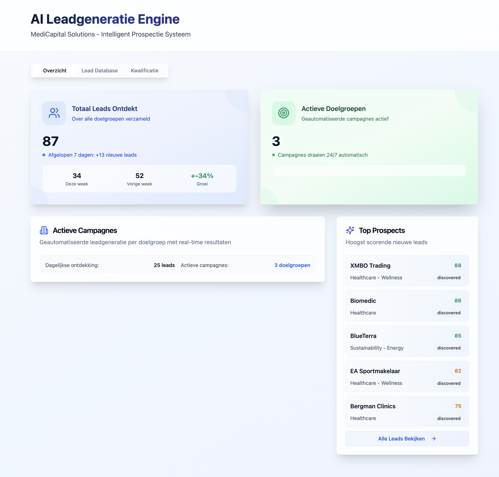
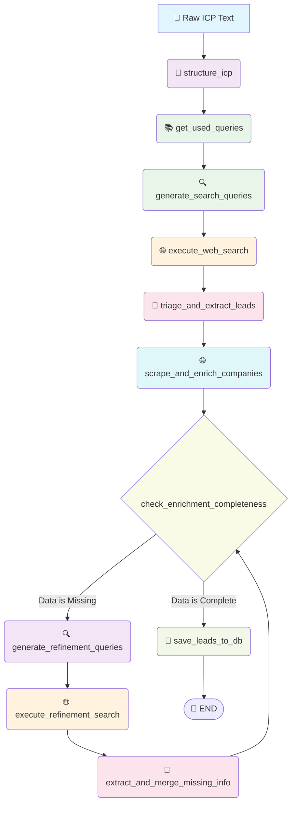

<div align="center">

# 🚀 MediCapital Lead Generation Engine

*AI-Powered B2B Lead Discovery for Equipment Leasing*

[](https://www.python.org/downloads/)
[](https://langchain.com/)
[](https://langchain-ai.github.io/langgraph/)
[](https://ai.google.dev/)

---

*Automatically discovers and qualifies high-quality B2B leads in the Netherlands and Belgium for equipment leasing opportunities using advanced AI workflows.*

</div>

## 🎯 **Overview**

The MediCapital Lead Generation Engine is a sophisticated AI-powered system that autonomously discovers, qualifies, and manages B2B leads for equipment leasing in the Netherlands and Belgium. Built with cutting-edge technologies like LangGraph and Google Gemini, it transforms unstructured market intelligence into actionable sales opportunities.


*Screenshot of the main application dashboard showing lead discovery and qualification interface*

### **🎪 Key Capabilities**

| Feature | Description |
|---------|-------------|
| 🧠 **AI-Powered Discovery** | Uses Google Gemini to intelligently parse ICPs and generate targeted search strategies. |
| 🌐 **Interactive Frontend Control** | FastAPI backend allows the frontend to trigger and monitor lead generation tasks. |
| 🛡️ **Resilient Search** | Multi-provider search (Serper, Tavily, Brave, Firecrawl) with a circuit breaker for high availability. |
| LOOP **Cost-Optimized Refinement Loop** | Intelligently seeks missing data points using performance-tiered, cost-effective search queries. |
| 🔍 **Smart Deduplication** | Advanced company name normalization prevents duplicate entries. |
| ⏰ **Automated & Manual Execution** | Run workflows on a schedule, trigger them manually via CLI, or start them from the web UI. |
| 📊 **Production-Ready** | Scalable architecture using MongoDB Atlas, FastAPI, and a worker-based system. |
| 🚀 **High Performance** | Fully asynchronous pipeline for concurrent web searches, scraping, and AI processing. |

---

## 🧩 **Tech Stack**

| Layer | Technologies |
|-------|-------------|
| **AI & LLM** |    |
| **Backend** |     |
| **Frontend** |     |
| **Database** |   |
| **Search & Scraping APIs** |     |
| **Tooling** |    |

---

## 🏗️ **System Architecture**

The system follows a **LangGraph workflow** pattern, processing leads through a series of intelligent nodes. It includes a robust, multi-attempt refinement loop for comprehensive data enrichment and a circuit breaker for resilient web searching.



### **🔄 Workflow Stages**

1.  **📋 ICP Structuring**: Converts raw business requirements into structured JSON, caching the result for efficiency.
2.  **📚 Get Used Queries**: Fetches previously executed search queries from MongoDB to avoid redundant searches.
3.  **🎯 Query Generation**: Creates a list of targeted Dutch search queries using strategic patterns, avoiding already used queries.
4.  **🌐 Web Search**: Executes concurrent searches using a **multi-provider strategy** (Serper, Tavily, Brave, Firecrawl). A circuit breaker temporarily disables any provider that is failing or rate-limited, ensuring high availability.
5.  **🤖 AI Triage**: An LLM evaluates each search result for B2B relevance and ICP fit, filtering out noise.
6.  **🕸️ Scraping & Enrichment**: The official company website is scraped, and an LLM extracts key data points (contact info, employee count, etc.) into a structured format.
7.  **🔎 Completeness Check & Refinement Loop**: The system checks if critical data is missing.
    *   If data is missing, it enters a **refinement loop**.
    *   **Generate Refinement Queries**: Creates new, highly specific, and cost-optimized queries to find the missing information. For example, it uses performance-tiered queries to find `employee_count`.
    *   **Execute Refinement Search**: Runs the new queries.
    *   **Extract & Merge**: A targeted LLM call extracts only the missing data from the new search results and merges it.
    *   The loop repeats until the lead is sufficiently enriched or a max attempt limit is reached.
8.  **💾 Database Storage**: Saves unique, enriched leads to the MongoDB database with smart deduplication.

---

## 📁 **Codebase Structure**

The backend codebase is organized into modular components, with the core workflow logic residing in the `graph/nodes` directory.

```
backend/
├── 📦 app/
│   ├── 📄 api/
│   │   ├── main.py          # FastAPI endpoint definitions
│   │   └── models.py        # Pydantic models for API requests/responses
│   ├── 🔧 core/
│   │   ├── settings.py      # Configuration management (Pydantic)
│   │   └── clients.py       # API clients (Gemini, Multi-Provider Search)
│   ├── 🗄️ db/
│   │   ├── mongodb.py       # MongoDB connection management
│   │   ├── mongo_models.py  # Pydantic models for MongoDB documents
│   │   └── repositories.py  # Repository pattern for DB operations
│   ├── 🕸️ graph/
│   │   ├── state.py         # Pydantic models for workflow state
│   │   ├── prompts.py       # Centralized prompt management
│   │   ├── workflow.py      # LangGraph workflow assembly
│   │   └── nodes/           # INDIVIDUAL WORKFLOW NODES
│   │       ├── structure_icp.py
│   │       ├── generate_search_queries.py
│   │       ├── execute_web_search.py
│   │       ├── triage_and_extract_leads.py
│   │       ├── scrape_and_enrich_companies.py
│   │       ├── save_leads_to_db.py
│   │       └── refinement/  # Refinement loop nodes
│   ├── 🛠️ services/
│   │   ├── company_service.py
│   │   └── company_name_normalizer.py
│   ├── 🚀 main.py           # CLI interface (Typer)
│   └── 🛰️ api_server.py     # FastAPI server entry point (Uvicorn)
├── 📝 prompts/              # Prompt templates (.txt, .json)
├── 🧪 tests/                # Pytest unit and integration tests
├── 📜 analyze_missing_company_data.py # Utility script for data analysis
├── 📜 enrich_existing_companies.py   # Utility script for batch enrichment
└── ⚙️ pyproject.toml        # Project config & dependencies
```

---

## 🚀 **Getting Started**

### **Prerequisites**

- **Python 3.12+** - [python.org](https://www.python.org/downloads/)
- **Bun** - [bun.sh](https://bun.sh/) (for frontend)
- **uv** - [astral.sh/uv](https://astral.sh/uv) (for backend)

### **1. Environment Setup**

Create a `.env` file in the `backend/` directory by copying the example below.

**Required API Keys & Configuration:**
```env
# LangSmith - For observability and debugging
# Get your key from https://smith.langchain.com/
LANGCHAIN_TRACING_V2="true"
LANGCHAIN_ENDPOINT="https://eu.api.smith.langchain.com"
LANGCHAIN_API_KEY="your_langsmith_key_here"
LANGCHAIN_PROJECT="MediCapital Lead Engine"

# LLM Provider
# Get your key from https://aistudio.google.com/app/apikey
GOOGLE_API_KEY="your_gemini_key_here"

# Search Providers
# The system uses a tiered approach (Serper > Tavily > Brave > Firecrawl).
# Provide keys for as many as you can to increase reliability.
# At least one key is required for the system to run.
SERPER_API_KEY="your_serper_key_here"
TAVILY_API_KEY="your_tavily_key_here"
BRAVE_API_KEY="your_brave_search_key_here"
FIRECRAWL_API_KEY="your_firecrawl_key_here"

# Database - MongoDB
# Get your connection string from MongoDB Atlas
MONGODB_URI="your_mongodb_connection_string"
MONGODB_DATABASE="medicapital"
DB_USER="your_mongodb_username"
DB_PASSWORD="your_mongodb_password"

# Log Level
LOG_LEVEL="INFO"
```

### **2. Installation & Setup**

```bash
# --- Backend ---
cd backend
make setup          # Installs uv, creates venv, installs deps
make create-db      # Initialize MongoDB database and indexes

# --- Frontend ---
cd ../frontend
bun install         # Install dependencies
```

### **3. Running the Application**

The application consists of a backend API/worker and a frontend client.

1.  **Start the Backend API:**
    ```bash
    cd backend
    make run-api
    # API server starts at http://localhost:8000
    ```

2.  **Start the Frontend:**
    ```bash
    cd frontend
    bun run dev
    # Frontend dev server starts at http://localhost:5173
    ```

### **4. Lead Generation Commands**

You can trigger the lead generation process in several ways:

-   **From the Web UI (Recommended):** Click the "Scrape New Leads" button in the application dashboard.
-   **Via CLI (for a single run):**
    ```bash
    cd backend
    python -m app.main run-once --queries-per-icp 5
    ```
-   **Via Scheduled Worker (for production):**
    ```bash
    cd backend
    # This command is typically run by a process manager like systemd or in a Docker container.
    # See the Procfile for production commands.
    python -m app.main start-scheduler --interval-hours 4
    ```

---

## 🎛️ **API Endpoints**

The FastAPI backend provides the following endpoints for the frontend:

| Endpoint | Method | Description |
|----------|--------|-------------|
| `/api/companies` | GET | List companies with filtering, sorting, and pagination. |
| `/api/companies/{id}` | GET | Get details for a single company. |
| `/api/companies/{id}/status` | PATCH | Update a company's status (e.g., 'qualified', 'rejected'). |
| `/api/dashboard/stats` | GET | Get aggregated statistics for the dashboard. |
| `/api/scrape-leads` | POST | **Trigger a new lead scraping process in the background.** |
| `/api/scrape-status` | GET | **Check the current status of the scraping process.** |
| `/health` | GET | Health check endpoint. |

---

## 🛠️ **Utility Scripts**

The `backend/` directory contains standalone scripts for data maintenance.

-   **`analyze_missing_company_data.py`**:
    -   **Purpose**: Scans the database and generates a report on which data fields are most frequently missing across all companies.
    -   **Usage**: `python analyze_missing_company_data.py`

-   **`enrich_existing_companies.py`**:
    -   **Purpose**: Finds companies with incomplete data and runs them through the refinement pipeline to fill in the gaps.
    -   **Usage**: `python enrich_existing_companies.py --batch-size 5 --dry-run`

---

## 🗄️ **Database Schema**

The primary data is stored in the `companies` collection in MongoDB.

| Field | Type | Description |
|-------|------|-------------|
| `_id` | ObjectId | MongoDB document identifier. |
| `normalized_name` | String | Cleaned company name (indexed for uniqueness). |
| `discovered_name` | String | Original company name as found. |
| `source_url` | String | URL where company was first discovered. |
| `website_url` | String | The company's official website URL. |
| `country` | String(2) | Country code (NL/BE). |
| `icp_name` | String | The ICP profile name that generated this lead. |
| `status` | String | Lead status (`discovered`, `in_review`, `qualified`, `rejected`). |
| `initial_reasoning` | String | AI's initial justification for the lead. |
| `company_description`| String | AI-generated summary of the company's business. |
| `contact_email` | String | Contact email address. |
| `contact_phone` | String | Contact phone number. |
| `location_details`| String | Full location (city, country). |
| `employee_count` | String | Estimated number of employees (e.g., "10-50"). |
| `estimated_revenue`| String | Estimated annual revenue. |
| `equipment_needs` | String | Notes on potential equipment needs. |
| `recent_news` | String | Summary of recent company news. |
| `qualification_score` | Integer | AI-generated score (0-100) on ICP fit. |
| `qualification_details` | Object | Detailed breakdown of qualification criteria scores. |
| `enriched_data` | Object | Raw enriched data object from scraping. |
| `created_at` | DateTime | Discovery timestamp. |
| `updated_at` | DateTime | Last modification timestamp. |

---

## 🧪 **Testing**

```bash
# Run the full test suite
make test

# Run a quick, 1-query test of the entire pipeline
make test-single-company

# Run with coverage report
make test-cov
```

---

## 🤝 **Contributing**

This is a private project for MediCapital Solutions. For internal development:

1.  Create feature branch from `main`.
2.  Implement changes with tests.
3.  Update documentation as needed.
4.  Submit pull request for review.

---

## 📄 **License**

**Private** - MediCapital Solutions

*This software is proprietary and confidential. Unauthorized copying, distribution, or use is strictly prohibited.*

---

<div align="center">

**Built with ❤️ for MediCapital Solutions**

*Transforming equipment leasing through intelligent lead generation*

</div>
